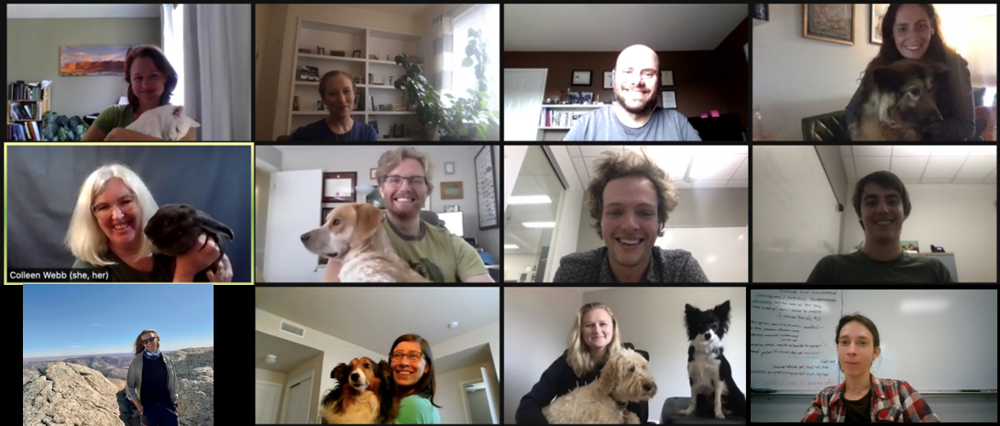

The Webb Lab focuses on research that elucidates how interactions among individual organisms scale up to generate population or community level patterns through both ecological and evolutionary mechanisms.  We are particularly interested in trait-based ecology and in the dynamics of diseases.

The interactions of individuals are difficult to observe, yet they are the drivers of important population and community ecology patterns.  For example, host-pathogen interactions strongly impact the spatial, temporal and evolutionary patterns of disease, which we need to better understand in order to inform control of zoonotic diseases.  While interactions are difficult to observe, we can use models of different interaction types and their match to observed patterns to determine which interaction types are most important in driving the patterns we see.

Many Webb Lab projects incorporate the effects of anthropogenic change in ecological systems that then impact human society and health. For example, the impact of ecological interactions in natural and human modified ecosystems on zoonotic and livestock disease outbreaks.

Check out our research projects for more details, but examples of general questions we address include:

* Which mechanisms affect the dynamics of highly virulent diseases?  How do highly virulent diseases persist?
* What can the traits of organisms tell us about the dynamics of biodiversity and the response of ecosystem function to changes in the environment and biodiversity?

Webb Lab research is driven by biological questions but our approach is quantitative, including applied statistics, dynamical systems, simulations, and Bayesian hierarchical modeling. Members of the Webb Lab develop data-driven, quantitative approaches customized to a wide range of biological problems in natural and agricultural systems.
